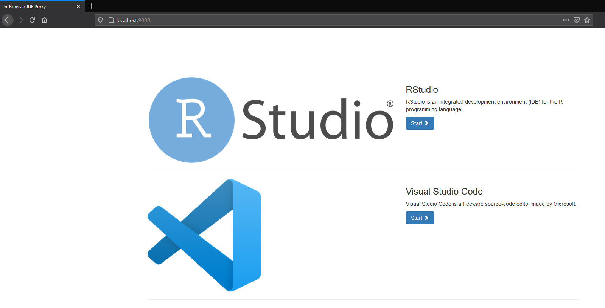

# IDE in the browser. Scalable and multi-user-friendly

- [IDE in the browser. Scalable and multi-user-friendly](#ide-in-the-browser-scalable-and-multi-user-friendly)
  - [How to start](#how-to-start)
  - [Advanced usage](#advanced-usage)
    - [Enable Authentication](#enable-authentication)
    - [Choose another template](#choose-another-template)
  - [Further information](#further-information)

## How to start

1. Clone this repo by using:

    ```bash
    git clone https://github.com/joundso/in-browser-ide.git in-browser-ide
    cd in-browser-ide
    ```

2. Run the container:

    ```bash
    sudo bash ./startup.sh
    ```

3. Go to [`localhost:9000`](http://localhost:9000) (or whatever port you specified in your docker-compose file) and select one of the images you have specified in the [`shinyproxy/application.yml`](./shinyproxy/application.yml) file.
   1. **RStudio** is now available at [`localhost:9000/app/rstudio`](http://localhost:9000/app/rstudio)
   2. **Visual Studio Code** is now available at [`localhost:9000/app/vscode`](http://localhost:9000/app/vscode)

4. This should be similar to what you can see now:
  

5. Stop the environment by running `docker-compose down`.

## Advanced usage

### Enable Authentication

To enable user authorization simply change the first lines in [`shinyproxy/application.yml`](./shinyproxy/application.yml). See [here](https://shinyproxy.io/documentation/configuration/#authentication) to read the information material.

### Choose another template

1. Create a new folder within `shinyproxy/templates/` and create a file you want to replace. You can use the already existing folders "1col", "2col" or "modified_navbar" as orientation.
2. Change the `proxy.template-path: ./templates/1col` to another folder containing the files you want to replace.
3. Restart the shinyproxy service: `docker-compose down && docker-compose up -d`

## Further information

- The repo for the Visual Code stuff: <https://github.com/joundso/vscode-docker>
- The homepage of ShinyProxy: <https://shinyproxy.io/>
- The github repo of ShinyProxy: <https://github.com/openanalytics/shinyproxy>
- A template for the `application.yml` file can be found here: <https://shinyproxy.io/documentation/configuration/>
- A very good example which helped a lot creating this repo and also holds **examples of how to include images in the docker-compose file** can be found here: <https://github.com/shrektan/shinyproxy-docker-compose-example>
- Another repo with impact to this can be accessed here: <https://github.com/kassambara/shinyproxy-config>
- Official examples of how to start shinyproxy in different setups can be found here: <https://github.com/openanalytics/shinyproxy-config-examples>
- A minimal example with three files can be found in this issue: <https://github.com/openanalytics/shinyproxy/issues/99>
